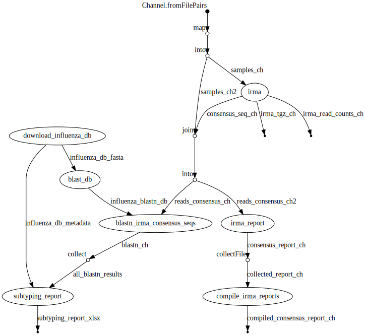

# Influenza Genome Analysis Nextflow Workflow

## Introduction

This repo contains a [Nextflow] workflow for the [IRMA] assembly and H/N subtyping by nucleotide [BLAST] against the [NCBI Influenza DB] of Illumina sequenced influenza virus genomes.

## Pipeline Steps

| Step                                                | Main program                        |
|-----------------------------------------------------|-------------------------------------|
| IRMA iterative assembly of genome segments          | IRMA                                |
| H/N subtyping                                       | BLAST+                              |


## Getting Started

1. Install [Nextflow][] (Java 8 or later must be installed; Conda provides an easy way to install Nextflow with all dependencies required)

Conda install:

```
# Setup Conda channels for Bioconda and Conda Forge
conda config --add channels defaults
conda config --add channels bioconda
conda config --add channels conda-forge
# Install Nextflow with Conda
conda install nextflow
```

Manual install:

```bash
curl -s https://get.nextflow.io | bash
# install nextflow globally for all users
sudo mv nextflow /usr/local/bin/
# or locally to your user
mkdir -p ~/bin
mv nextflow ~/bin/
```

2. Install [Singularity][] (required for running workflow both locally and in a high-performance computing cluster)

3. Try to show help info for this workflow

```bash
nextflow run peterk87/nf-iav-illumina --help
```

4. Run on some test data

Download reads for Influenza A virus (A/England/195/2009(H1N1)) (ERR3338653; https://www.ncbi.nlm.nih.gov/sra/ERX3363362[accn]) with [fasterq-dump](https://github.com/ncbi/sra-tools/wiki/HowTo:-fasterq-dump) and this Nextflow workflow:
```
mkdir -p test/reads && cd test/reads
fasterq-dump ERR3338653
cd ..
nextflow run peterk87/nf-iav-illumina --reads "reads/*_{1,2}.fastq" --outdir results
```

You should find the subtype to be H1N1 for ERR3338653.

## Usage

### Run locally on directory of Illumina paired-end reads

*NOTE: Please ensure that your workstation has [Singularity][] installed! Run `which singularity` and `singularity --version` to ensure that a recent version of Singularity has been installed.*

```
nextflow run peterk87/nf-iav-illumina \
  --reads "reads/*_R{1,2}*.fastq.gz" \
  --outdir /path/to/results/outdir
```

### Run on a high-performance computing (HPC) cluster with SLURM

*NOTE: Please ensure that your cluster has [Singularity][] installed! Run `which singularity` and `singularity --version` to ensure that a recent version of Singularity has been installed.*

```
nextflow run peterk87/nf-iav-illumina \
  --reads "reads/*_R{1,2}*.fastq.gz" \
  --outdir /path/to/results/outdir \
  -profile slurm \
  --slurm_queue SLURM_QUEUE_NAME 
```

Replace `SLURM_QUEUE_NAME` with the name of the queue or partition you can submit to on your cluster.
Contact your cluster tech support to find out which queue you can submit to on the cluster. 

Show SLURM info about your cluster with the `sinfo` command and `squeue` to show how busy the cluster is. 

### Show help info

```
nextflow run peterk87/nf-iav-illumina --help
```

```
===========================================
peterk87/nf-iav-illumina  ~  version 1.1.0
===========================================

  Git info: null - null [null]

Usage:

The typical command for running the pipeline is as follows:

  nextflow run peterk87/nf-iav-illumina --reads "reads/*R{1,2}*.fastq.gz" --outdir results

NOTE: Please ensure you have Singularity installed prior to running this workflow. (https://sylabs.io/guides/3.3/user-guide/quick_start.html#quick-installation-steps)

Mandatory Options:
  --reads           Input paired-end Illumina FASTQ reads; quotes required! (default: "reads/*R{1,2}*.fastq.gz")
Other Options:
  --outdir          Output results directory (default: results)
  -w/--work-dir     The temporary directory where intermediate data will be saved (default: work)
  -profile          Configuration profile to use [standard, slurm] (default: "standard")
Cluster Options:
  --slurm_queue     Name of SLURM queue to run workflow on; use with -profile slurm
```


## Results

This workflow outputs results in an output directory with the following structure:

```
<results output directory>
├── consensus
│   ├── Sample1
│   │   ├── Sample1_1.fa
│   │   ├── ...
│   │   └── Sample1_8.fa
│   ├── Sample2
│   │   ├── Sample2_1.fa
│   │   ├── ...
│   │   └── Sample2_8.fa
├── irma
│   ├── Sample1
│   │   └── Sample1-read-counts.tsv
│   ├── Sample2
│   │   └── Sample2-read-counts.tsv
│   ├── Sample1.tar.gz
│   ├── Sample2.tar.gz
├── irma-consensus-report.tsv
├── pipeline_info
│   ├── nf-iav-illumina_DAG.svg
│   ├── nf-iav-illumina_report.html
│   ├── nf-iav-illumina_timeline.html
│   └── nf-iav-illumina_trace.txt
└── subtyping_report.xlsx
```

- `consensus` contains [IRMA] generated consensus sequences for each sample for each of the genome segments (if available)
- `irma` contains a `.tar.gz` of the [IRMA] output directory for each sample
- `irma-consensus-report.tsv` is a tab-delimited table of the number of [IRMA] consensus genome segments obtained for each sample
- `subtyping_report.xlsx` is summary report of H/N subtyping by [BLAST] containing subtyping results for all input samples


### Workflow Execution Graph




[NCBI Influenza DB]: ftp://ftp.ncbi.nih.gov/genomes/INFLUENZA/
[BLAST]: https://blast.ncbi.nlm.nih.gov/Blast.cgi
[IRMA]: https://wonder.cdc.gov/amd/flu/irma/
[Nextflow]: https://www.nextflow.io/
[Singularity]: https://www.sylabs.io/guides/3.0/user-guide/quick_start.html#quick-installation-steps
